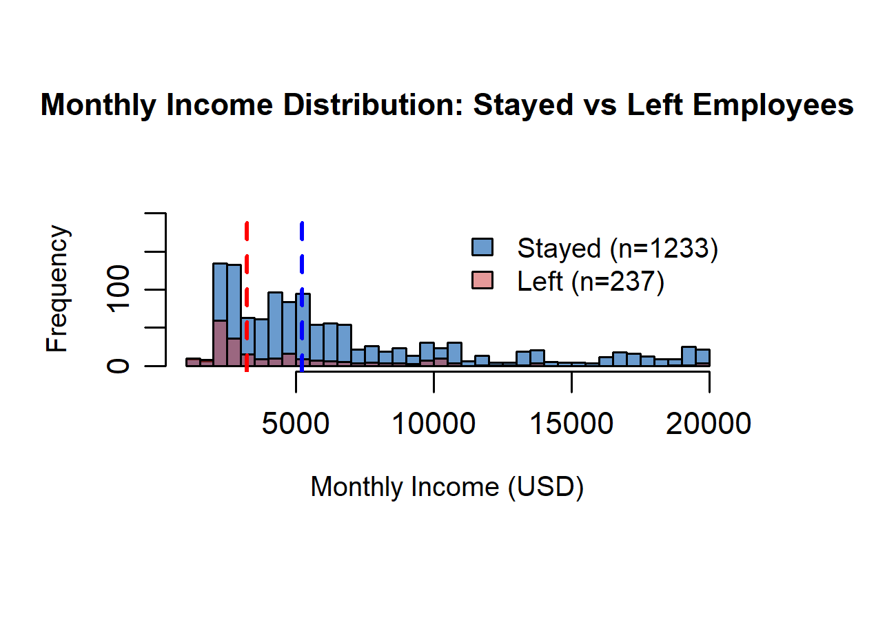
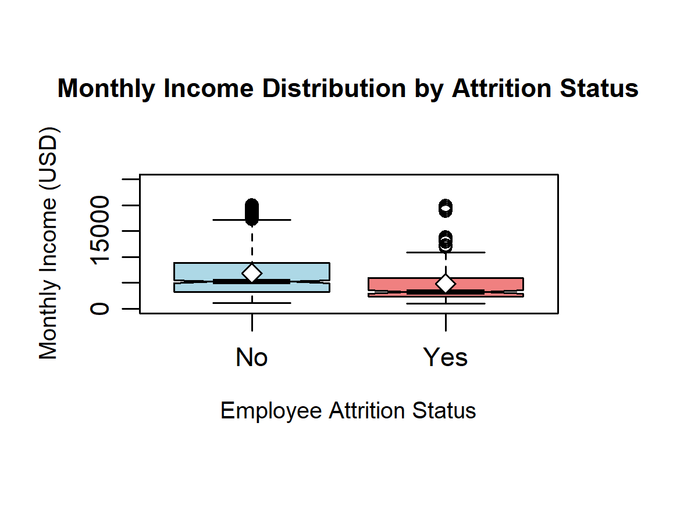

# HR Employee Attrition Analysis Report
**Course:** 7COM1079 - Statistical Programming  
**Date:** December 3, 2025  
**Authors:** Ali Iqbal, Ahmed Yar, Nouman Akbar, Ataullah, Muhammad Asim

---

## 1. Introduction

This report presents a statistical analysis of the IBM HR Employee Attrition dataset to investigate factors related to employee turnover. The dataset contains 1,470 employee records with 35 variables including demographics, job characteristics, and attrition status.

## 2. Research Question

**Is there a significant difference in monthly income between employees who left the company and those who stayed?**

## 3. Hypotheses

- **H₀ (Null Hypothesis):** There is no significant difference in mean monthly income between employees who left and those who stayed (μ₁ = μ₂)
- **H₁ (Alternative Hypothesis):** There is a significant difference in mean monthly income between the two groups (μ₁ ≠ μ₂)
- **Significance Level:** α = 0.05

## 4. Methodology

### 4.1 Data Preparation
- Dataset: IBM HR Employee Attrition (1,470 records)
- Variables analyzed: Attrition (Yes/No), MonthlyIncome
- No missing values detected

### 4.2 Descriptive Statistics

**Employees Who Stayed (n = 1,233):**
- Mean income: $6,832.74
- Median income: $4,919
- Standard deviation: $4,705.47

**Employees Who Left (n = 237):**
- Mean income: $4,787.09
- Median income: $3,202
- Standard deviation: $3,936.18

**Observation:** Initial analysis shows employees who stayed earn approximately $2,045 more on average than those who left.

### 4.3 Statistical Testing

**Normality Testing:**
- Shapiro-Wilk test performed on both groups
- Result: Non-normal distribution detected (p < 0.05)
- Decision: Use non-parametric Mann-Whitney U test

**Mann-Whitney U Test:**
- Non-parametric alternative to independent t-test
- Tests if two groups come from same distribution

## 5. Results

### 5.1 Mann-Whitney U Test Results
- **Test Statistic (W):** 108,620
- **P-value:** < 2.2e-16 (highly significant)
- **Decision:** Reject the null hypothesis (p < 0.05)

**Conclusion:** There is statistically significant evidence that monthly income differs between employees who left and those who stayed.

### 5.2 Effect Size
- Mean difference: $2,045.65
- Median difference: $1,717
- **Practical Significance:** The difference represents approximately 30% lower income for employees who left

### 5.3 Visualizations
Two charts were generated to visualize the findings:
1. **Income Histogram:** Shows distribution overlap with employees who left concentrated at lower income levels
2. **Boxplot Comparison:** Clearly demonstrates higher median and spread for employees who stayed

## 6. Discussion

### 6.1 Interpretation
The analysis revealed a highly significant relationship between income and attrition. Employees who left earned substantially less ($2,045 less on average) than those who stayed. This suggests that competitive compensation may be a key factor in employee retention.

### 6.2 Implications
- Organizations should review compensation structures for lower-earning employees
- Salary adjustments might reduce attrition rates
- Income inequality within the company may drive turnover

### 6.3 Limitations
- Correlation does not imply causation - other factors may influence both income and attrition
- Dataset represents a single organization - generalizability may be limited
- Other variables (job satisfaction, work-life balance) were not controlled for

## 7. Conclusion

This statistical analysis found compelling evidence that monthly income significantly differs between employees who left and those who stayed (p < 0.001). Employees who left earned approximately $2,045 less on average, representing a 30% income gap. These findings suggest that competitive compensation strategies may be effective in reducing employee attrition.

**Recommendations:**
1. Conduct salary benchmarking for retention risk groups
2. Implement targeted compensation reviews
3. Investigate additional factors contributing to attrition

---

## References
- IBM HR Analytics Employee Attrition Dataset
- Field, A. (2013). Discovering Statistics Using IBM SPSS Statistics
